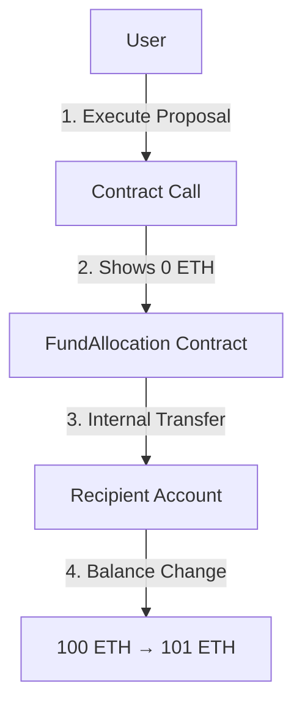

# Understanding Smart Contract Fund Transfers

## Transaction Example
Transaction Hash: `0xd5ec6b58435b3e6d4b6cc19678a74bdfeb2786069117eb94379ec452af1006b`

## Visual Flow



## Step-by-Step Verification

### 1. Initial Transaction
- **What you see in Ganache:**
  - Transaction value: 0 ETH
  - To: Contract Address
  - From: Your Address
  ```
  This is normal! The 0 ETH value is because it's a contract interaction.
  ```

### 2. Finding the Recipient
- **Recipient Address:** `0xEA4204E9f8B8484Cde8d4075de8F4FE67aD25456`
- **How to verify:**
  1. Open Ganache
  2. Go to Accounts tab
  3. Find the recipient address
  4. Check balance history: 100 ETH → 101 ETH

### 3. Proof of Transfer
- **Balance Change Evidence:**
  ```
  Before: 100 ETH
  After:  101 ETH
  Change: +1 ETH
  ```

## Technical Explanation

### Why It Looks Complex
1. **Smart Contract Architecture:**
   ```
   User → Contract Call → Internal Transfer → Recipient
   ```

2. **Two-Step Process:**
   - First transaction (visible): Contract interaction (0 ETH)
   - Second transaction (internal): Actual fund transfer (1 ETH)

### How to Demonstrate
1. Show the transaction in Ganache
2. Point out the 0 ETH value
3. Show the recipient's account
4. Demonstrate the balance change

## Common Questions

Q: Why does the transaction show 0 ETH?
A: Because it's a contract interaction. The actual transfer happens internally.

Q: How do we know the transfer occurred?
A: Check the recipient's balance change from 100 to 101 ETH.

Q: Why can't we see the recipient address directly?
A: It's stored in the proposal data within the smart contract.

## Conclusion
This is standard blockchain behavior for contract-based transfers:
1. Contract calls show 0 ETH
2. Internal transactions handle the actual transfer
3. Balance changes prove the transfer occurred 